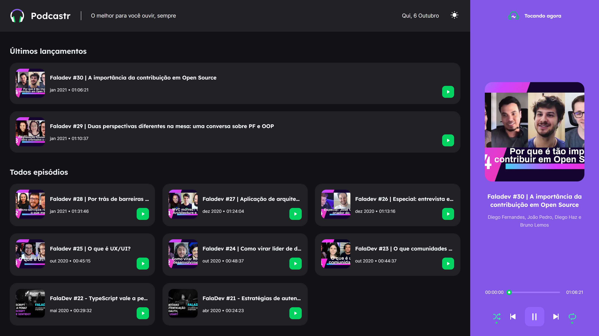
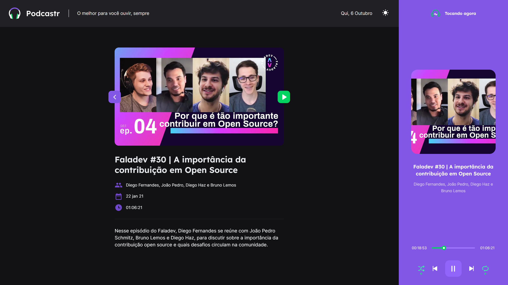
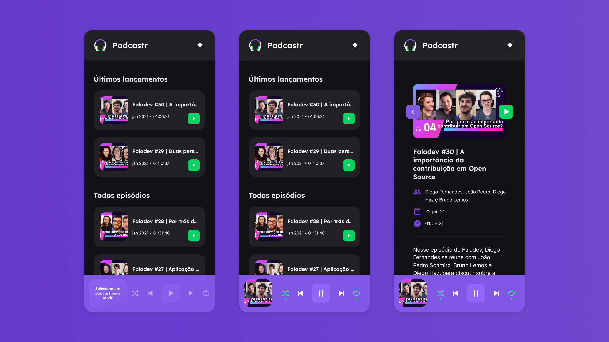

<div align="center">
   
   <h3>O melhor para você ouvir, sempre</h3>
</div>
<br/>
<div align="center">
   <a href="https://github.com/vpmattei">
      
   </a>

   

   

   <a aria-label="React Version" href="https://github.com/facebook/react/blob/master/CHANGELOG.md#1702-march-22-2021">
      </img>
   </a>

   <a href="https://github.com/vpmattei/podcastrnext/commits/main">
      
   </a>

   <a href="https://github.com/vpmattei/podcastrnext/issues">
      
   </a>

   <a href="https://github.com/vpmattei/podcastrnext/pulls">
      
   </a>

   <a href="https://github.com/vpmattei/podcastrnext/blob/main/LICENSE.md">
      
   </a>
   </br>
   </br>
   <a href="#-tecnologias-utilizadas">
      
      
      
      
   </a>
</div>

</br>
<div align="center">

[**Sobre**](#-sobre) &nbsp;&nbsp;**|**&nbsp;&nbsp;
[**Features**](#-features) &nbsp;&nbsp;**|**&nbsp;&nbsp;
[**Tecnologias e ferramentas utilizadas**](#-tecnologias-e-ferramentas-utilizadas) &nbsp;&nbsp;**|**&nbsp;&nbsp;
[**Layout**](#-layout) &nbsp;&nbsp;**|**&nbsp;&nbsp;
[**Instalação e execução**](#-instalação-e-execução) &nbsp;&nbsp;**|**&nbsp;&nbsp;
[**Como contribuir**](#-como-contribuir) &nbsp;&nbsp;**|**&nbsp;&nbsp;
[**Contato**](#-contato) &nbsp;&nbsp;**|**&nbsp;&nbsp;
[**Licença**](#-licença)

</div>

## 📃 Sobre



**Podcastr** é uma aplicação desenvolvida durante a trilha de React na **Next Level Week**, evento promovido pela [**Rocketseat**](https://github.com/Rocketseat).

A proposta da aplicação é proporcionar aos usuários uma experiência imersiva ao ouvir podcasts, permitindo que acessem informações adicionais sobre os episódios enquanto utilizam um player customizado.



<br/>

> Durante o desenvolvimento, explorei o uso da API de áudio do HTML5 para criar o player, além de aprender mais sobre o **Next.js**, um framework poderoso para criação de aplicações React com SSR (Server Side Rendering).

## ✨ Features

- [x] Listagem dos episódios mais recentes
- [x] Página de detalhes do episódio selecionado
- [x] Exibição da data atual
- [x] Player com funções de shuffle, repetição, anterior, próximo e play/pause
- [x] Layout responsivo



- [x] Suporte a temas claro e escuro (Dark mode / Light mode)

## 🚀 Tecnologias e ferramentas utilizadas

- [**React**](https://reactjs.org/)
- [**Next.js**](https://nextjs.org/)
- [**TypeScript**](https://www.typescriptlang.org/)
- [**Sass**](https://sass-lang.com/)
- [**Axios**](https://axios-http.com/)
- [**Git**](https://git-scm.com/downloads)
- [**Visual Studio Code**](https://code.visualstudio.com/)

## 📟 Layout

O layout foi desenvolvido pela equipe da **Rocketseat** usando [**Figma**](https://www.figma.com). Confira o design: [**Podcastr**](https://www.figma.com/file/UwFEntsHpHYJlHNQAQr4gA/Podcastr/duplicate).

## 🔧 Instalação e execução

Clone o repositório:
```bash
git clone https://github.com/vpmattei/podcastrnext.git
```

Instale as dependências:
```bash
npm install
```

Inicie o projeto:
```bash
npm run dev
```

## 💡 Como contribuir

- Faça um **fork** do repositório;
- Crie uma branch para sua funcionalidade: `git checkout -b minha-feature`;
- Commit suas alterações: `git commit -m 'feat: Minha nova funcionalidade'`;
- Envie sua branch: `git push origin minha-feature`;
- Abra um **pull request**.

## 📲 Contato

Entre em contato por e-mail ou pelo GitHub:

<a href="mailto:viniciuspmattei@gmail.com"></a>
<a href="https://github.com/vpmattei"></a>
<a href="https://www.linkedin.com/in/vinícius-mattei/"></a>


## 📝 Licença

<a href="https://github.com/vpmattei/podcastrnext/blob/main/LICENSE.md">
    
</a>

Este projeto está sob a licença **MIT**. Veja o arquivo [LICENSE](LICENSE.md) para mais detalhes.

---

<h5 align="center">
  &copy;2025 - <a href="https://github.com/vpmattei/">Vinícius Pierre Mattei</a>
</h5>
